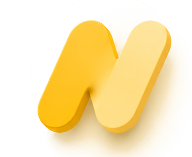
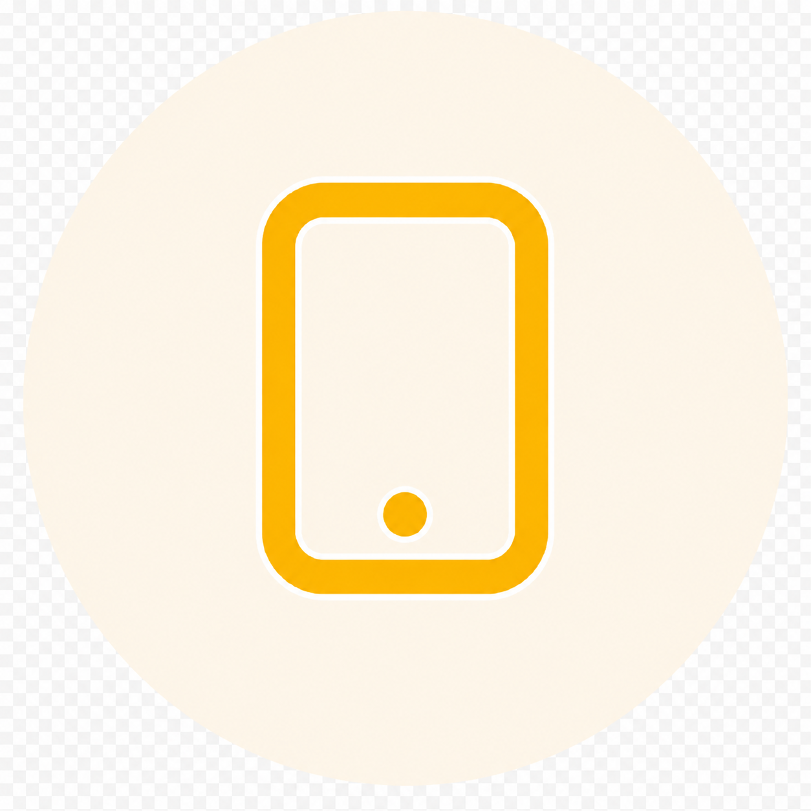
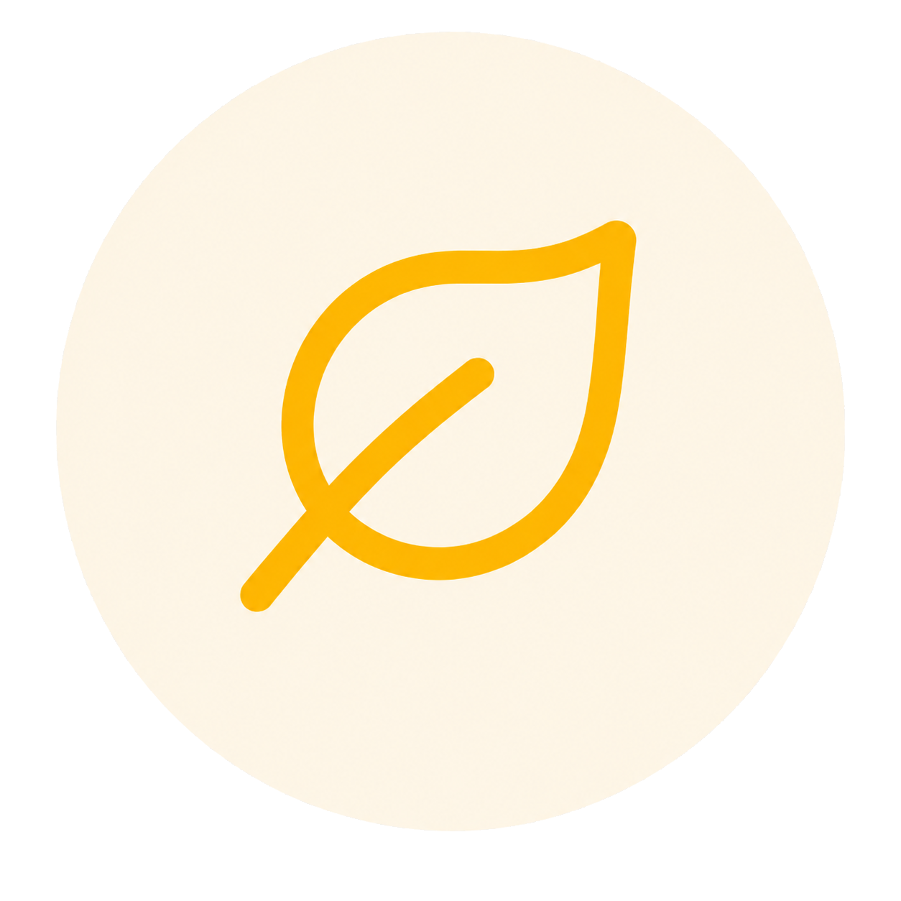
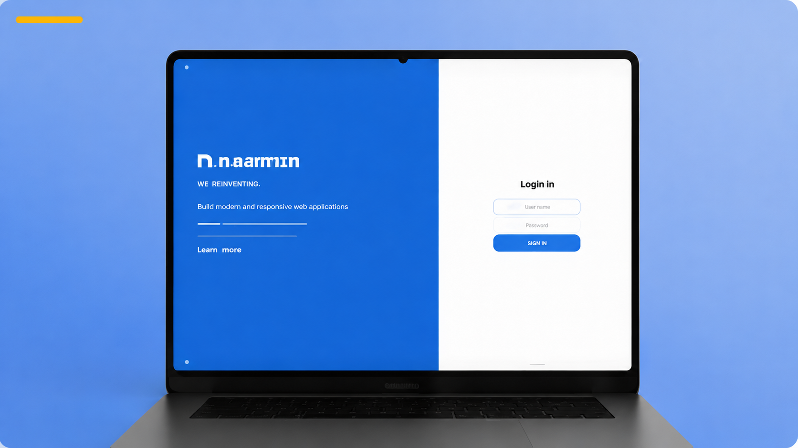
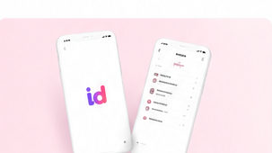
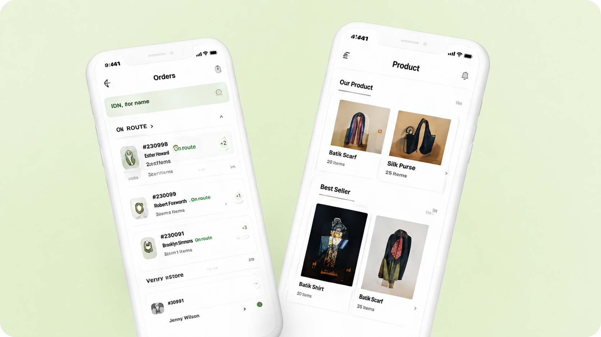

  

# Native

### From App to Interface — Native

플랫폼 특성에 맞게 구현해,  
기기에 맞는 자연스러운 경험을 제공합니다.

`Since 2026`

 

## 브랜딩

각 플랫폼에 맞게 사용자에게 자연스럽게 이어지도록 만들고,  
그 안에서 사용자에게 필요한 흐름과 편의를 풀어냅니다.

Native는 이 기준으로 플랫폼 위에서 자연스럽게 동작하는 앱을 만듭니다.

> Native는 iOS와 Android 네이티브 기반으로 앱을 개발하는 팀입니다.  
> 앱은 기기와 가장 가까운 환경에서 동작하며, 빠른 반응성과 자연스러운 사용 경험을 제공합니다.  
> 웹이나 다른 방식과 달리, 사용자의 행동과 흐름에 직접적으로 맞춰질 수 있다는 점에서 차이가 있습니다.
>
> 하지만 학교 내에서는 이러한 네이티브 앱 개발을 제대로 경험하고 다뤄볼 수 있는 환경이 부족합니다.  
> Native는 그 공백을 채우기 위해 만들어졌습니다.
>
> 단순히 기능을 구현하는 것을 넘어서, 플랫폼에 맞는 동작과 사용자 흐름을 직접 설계하고, 완성된 형태의 앱을 만들어보는 것을 목표로 합니다.

 

## 핵심 가치

<table>
  <tr>
    <td align="center" width="33%">
      
      <h3>User First</h3>
      
사용자 경험을 최우선으로 생각하며, 직관적이고 자연스러운 인터페이스를 설계합니다.

    </td>
    <td align="center" width="33%">
      
      <h3>Cross Platform</h3>
      
iOS는 iOS답게, Android는 Android답게 각 플랫폼의 특성을 존중합니다.

    </td>
    <td align="center" width="33%">
      
      <h3>Natural Design</h3>
      
자연에서 영감을 받은 디자인으로 사용자가 편안함을 느낄 수 있는 경험을 제공합니다.

    </td>
  </tr>
</table>

 

## 진행 중인 프로젝트

<table>
  <tr>
    <td width="33%" valign="top">
      
      <h3>
        
        홉스 (HOPES)
      </h3>
      
광주소프트웨어마이스터고 재학생, 신입생, 입학 희망자를 위한 RAG 기반 AI 챗봇 서비스

      

        <code>Flutter</code>
        <code>Android</code>
        <code>Front-End</code>
        <code>Back-End</code>
      

      2026년 7월 6일 → 2026년 7월 25일
    </td>
    <td width="33%" valign="top">
      
      <h3>
        
        잇다 (IT-DA)
      </h3>
      
프로젝트 제안부터 팀 매칭, 협업까지 학교 구성원을 하나로 연결하는 플랫폼

      

        <code>iOS</code>
        <code>Front-End</code>
        <code>Back-End</code>
        <code>Android</code>
      

      2026년 6월 28일 → 2026년 7월 15일
    </td>
    <td width="33%" valign="top">
      
      <h3>
        
        북온 (BookOn)
      </h3>
      
도서 검색부터 대출, AI 추천까지 도서관 이용의 모든 과정을 하나의 앱으로 연결하는 스마트 도서관 플랫폼

      

        <code>iOS</code>
        <code>Android</code>
        <code>Back-End</code>
      

      2026년 6월 22일 → 2026년 8월 6일
    </td>
  </tr>
</table>

 

© 2026 Native. All rights reserved.

<a href="#" aria-label="GitHub">
  <svg width="20" height="20" viewBox="0 0 24 24" role="img" aria-hidden="true">
    <path fill="#c2c2c2" d="M12 .5C5.7.5.5 5.7.5 12c0 5.1 3.3 9.4 7.9 10.9.6.1.8-.2.8-.5v-2c-3.2.7-3.9-1.4-3.9-1.4-.5-1.3-1.3-1.7-1.3-1.7-1.1-.7.1-.7.1-.7 1.2.1 1.8 1.2 1.8 1.2 1 1.8 2.7 1.3 3.4 1 .1-.8.4-1.3.7-1.6-2.6-.3-5.3-1.3-5.3-5.7 0-1.3.5-2.3 1.2-3.1-.1-.3-.5-1.5.1-3.1 0 0 1-.3 3.3 1.2a11.5 11.5 0 0 1 6 0C17.3 4.8 18.3 5.1 18.3 5.1c.6 1.6.2 2.8.1 3.1.8.8 1.2 1.8 1.2 3.1 0 4.4-2.7 5.4-5.3 5.7.4.4.8 1.1.8 2.2v3.3c0 .3.2.6.8.5 4.6-1.5 7.9-5.8 7.9-10.9C23.5 5.7 18.3.5 12 .5z" />
  </svg>
</a>

